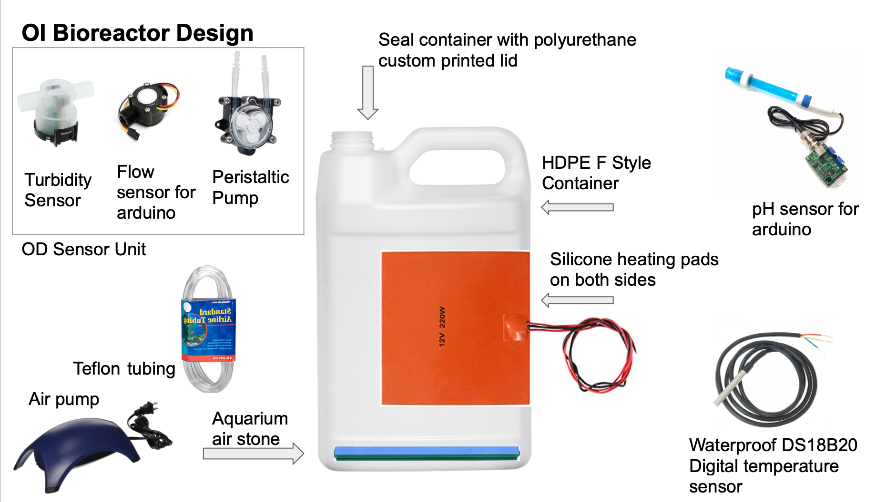
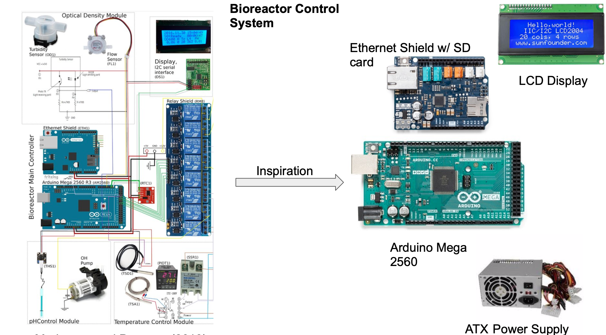
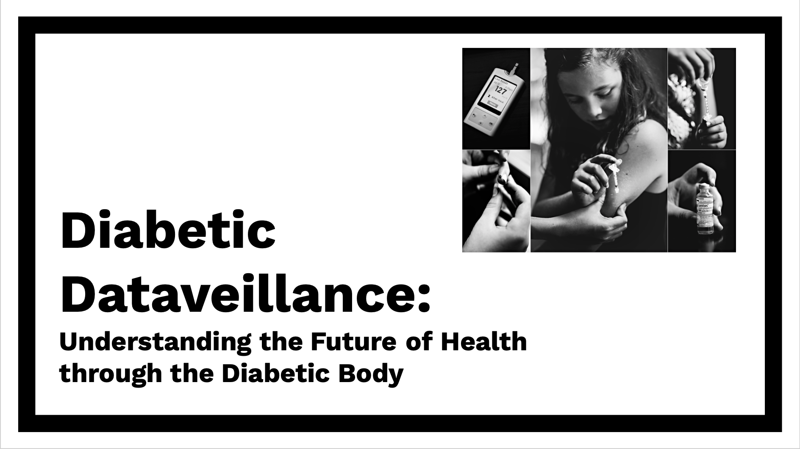

#### Open-Source Bioreactor | [Open Insulin](https://openinsulin.org)
---

	
		 

	
		 

> Designed protoype shown above for a low-cost pharmaceutical grade bioreactor for insulin production utilizing open-source hardware. Github repository for the control system coming soon! 

 

#### Current Research Project | Diabetic Dataveillance
---
Independent research project under NYU Department of Sociology examining the future of telemedicine and chronic illness surveillance through digital health tracking, focusing on type one diabetes.

	
	

The diabetic body, when connected to an insulin pump and continuous glucose monitor produces thousands of data points each day that are fed into algorithms that assess our physiological state and is then interpreted by medical practitioners using telemedecine. My research analyzes the privacy tradeoff and the impacts of health data-sharing on the construction of the medical gaze. Who has access to my body’s data? How might my health data be used to discriminate against me as a disabled person?